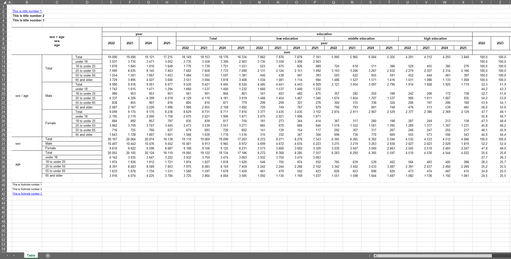

The new update offers some new ways of computing different percentages. The full release notes can be seen [here](https://github.com/s3rdia/qol/releases/tag/v1.2.2).

First of all lets look at an example of how tabulation looks like. First we generate a dummy data frame an prepare our formats, which basically translate single expressions into resulting categories, which later appear in the final table.

```{R, eval = FALSE}
my_data <- dummy_data(100000)

# Create format containers
age. <- discrete_format(
    "Total"          = 0:100,
    "under 18"       = 0:17,
    "18 to under 25" = 18:24,
    "25 to under 55" = 25:54,
    "55 to under 65" = 55:64,
    "65 and older"   = 65:100)

sex. <- discrete_format(
    "Total"  = 1:2,
    "Male"   = 1,
    "Female" = 2)

education. <- discrete_format(
    "Total"            = c("low", "middle", "high"),
    "low education"    = "low",
    "middle education" = "middle",
    "high education"   = "high")
```

And after that we just tabulate our data without any other step in between:

```{R, eval = FALSE}
# Define style
set_style_options(column_widths = c(2, 15, 15, 15, 9))

# Define titles and footnotes. If you want to add hyperlinks you can do so by
# adding "link:" followed by the hyperlink to the main text.
set_titles("This is title number 1 link: https://cran.r-project.org/",
           "This is title number 2",
           "This is title number 3")

set_footnotes("This is footnote number 1",
              "This is footnote number 2",
              "This is footnote number 3 link: https://cran.r-project.org/")

# Output complex tables with different percentages
my_data |> any_table(rows       = c("sex + age", "sex", "age"),
                     columns    = c("year", "education + year"),
                     values     = weight,
                     statistics = c("sum", "pct_group"),
                     pct_group  = c("sex", "age"),
                     formats    = list(sex = sex., age = age.,
                                       education = education.),
                     na.rm      = TRUE)

reset_style_options()
reset_qol_options()
```

The update now introduces two new keywords: row_pct and col_pct. Using these in the pct_group parameter enables us to compute row and column percentages regardless of which and how many variables are used.

```{R, eval = FALSE}
my_data |> any_table(rows       = c("sex", "age", "sex + age", "education"),
                     columns    = "year",
                     values     = weight,
                     by         = state,
                     statistics = c("pct_group", "sum", "freq"),
                     pct_group  = c("row_pct", "col_pct"),
                     formats    = list(sex = sex., age = age., state = state.,
                                       education = education.),
                     na.rm      = TRUE)
```

Also new is that you can compute percentages based on an expression of a result category. For this you can use the pct_value parameter put in the variable and desired expression which is your 100% and you are good to go:

```{R, eval = FALSE}
my_data |> any_table(rows        = c("age", "education"),
                     columns     = "year + sex",
                     values      = weight,
                     pct_value   = list(sex = "Total"),
                     formats     = list(sex = sex., age = age.,
                                        education = education.),
                     var_labels  = list(sex = "", age = "", education = "",
                                        year = "", weight = ""),
                     stat_labels = list(pct = "%", sum = "1000",
                                        freq = "Count"),
                     box         = "Attribute",
                     na.rm       = TRUE)
```

Here is an impression of what the results look like:



You probably noticed that there are some other options which let you design your tables in a flexible way. To get a better and more in depths overview of what else this package has to offer you can have a look here: <https://s3rdia.github.io/qol/>