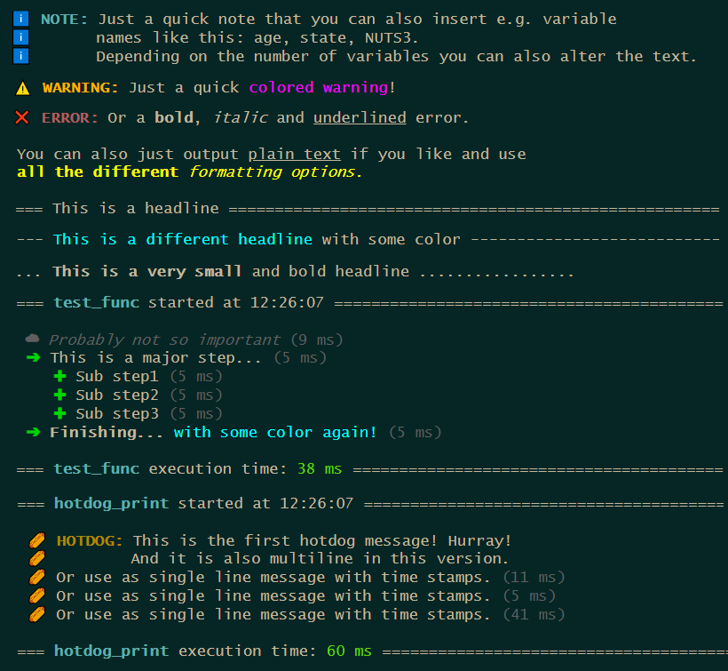
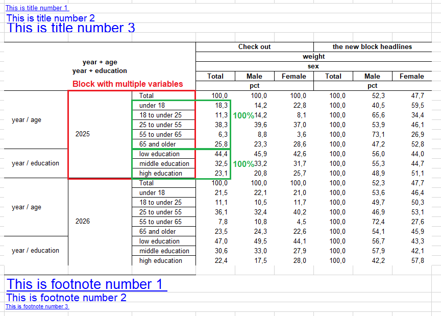

This update has yet again some new functions to offer, but also enhances many existing ones. The full release notes can be seen [here](https://github.com/s3rdia/qol/releases/tag/v1.3.0).

# New Functions

### Base R Message System

With the update comes a new message system purely counting on base R. It is fast, it is direct and you can easily implement your own custom message types. After running a function you can access the message stack to inspect all your messages you set up.



```{R, eval = FALSE}
# Example messages
print_message("NOTE", c("Just a quick note that you can also insert e.g.[? a / ]variable",
                        "name[?s] like this: [listing].",
                        "Depending on the number of variables you can also alter the text."),
             listing = c("age", "state", "NUTS3"))

print_message("WARNING", "Just a quick [#FF00FF colored warning]!")

print_message("ERROR", "Or a [b]bold[/b], [i]italic[/i] and [u]underlined[/u] error.")

print_message("NEUTRAL", c("You can also just output [u]plain text[/u] if you like and use",
                           "[#FFFF00 [b]all the different[/b] [i]formatting options.[/i]]"))

# Different headlines
print_headline("This is a headline")

print_headline("[#00FFFF This is a different headline] with some color",
               line_char = "-")

print_headline("[b]This is a very small[/b] and bold headline",
               line_char = ".",
               max_width = 60)

# Messages with time stamps
test_func <- function(){
    print_start_message()
    print_step("GREY", "Probably not so important")
    print_step("MAJOR", "This is a major step...")
    print_step("MINOR", "Sub step1")
    print_step("MINOR", "Sub step2")
    print_step("MINOR", "Sub step3")
    print_step("MAJOR", "[b]Finishing... [/b][#00FFFF with some color again!]")
    print_closing()
}

test_func()

# See what is going on in the message stack
message_stack <- get_message_stack()

# Set up a custom message
hotdog <- set_up_custom_message(ansi_icon = "\U0001f32d",
                                text_icon = "IOI",
                                indent    = 1,
                                type      = "HOTDOG",
                                color     = "#B27A01")

hotdog_print <- function(){
    print_start_message()
    print_message(hotdog, c("This is the first hotdog message! Hurray!",
                            "And it is also multiline in this version."))
    print_step(hotdog, "Or use as single line message with time stamps.")
    print_step(hotdog, "Or use as single line message with time stamps.")
    print_step(hotdog, "Or use as single line message with time stamps.")
    print_closing()
}

hotdog_print()

# See new message in the message stack
hotdog_stack <- get_message_stack()
```


### Saving And Loading Files

The package now offers functions to save and load RDS and [FST](https://www.fstpackage.org/) files. That in itself doesn't sound very spectacular, but there are some twists:

* You can not only save and load single files but multiple.
* The save function by default has a write protection.
* When loading files, the provided variables to keep are read in case insensitive and are returned in provided order.
* After loading the files can directly be stacked into one data frame.

```{R, eval = FALSE}
# Example data frame
my_data <- dummy_data(100)

# Save files
# NOTE: Normally you would pass in the path and file as character. For the
#       examples this is handled differently to provide runnable examples.
my_data |> save_file(path = tempdir(),
                     file = "testfile.fst")
my_data |> save_file(path = tempdir(),
                     file = "testfile.rds")

# Save file and only keep specific variables
# NOTE: Since the temporary file already exists now if you run the above code,
#       all the following save operations would throw errors because by default
#       the function write protects existing files. So for the following examples
#       the write protection is turned off.
my_data |> save_file(path    = tempdir(),
                     file    = "testfile.fst",
                     keep    = c(sex, age, state),
                     protect = FALSE)

# Save file and subset observations
my_data |> save_file(path    = tempdir(),
                     file    = "testfile.fst",
                     where   = sex == 1 & age > 65,
                     protect = FALSE)

# Example lists
my_df_list <- list(dummy_data(10),
                   dummy_data(10))

file1 <- file.path(tempdir(), "first.fst")
file2 <- file.path(tempdir(), "second.rds")
my_file_list <- list(file1, file2)

# Save multiple files at once
save_file_multi(data_frame_list = my_df_list,
                file_list       = my_file_list,
                protect         = FALSE)

# Save multiple files and only keep specific variables
save_file_multi(data_frame_list = my_df_list,
                file_list       = my_file_list,
                keep_list       = c(sex, age, state),
                protect         = FALSE)

# Save multiple files and keep different variables per data frame
save_file_multi(data_frame_list = my_df_list,
                file_list       = my_file_list,
                keep_list       = list(c(person_id, first_person),
                                       c(NUTS3, income, weight)),
                protect         = FALSE)

unlink(c(file1, file2,
         file.path(tempdir(), "testfile.fst"),
         file.path(tempdir(), "testfile.rds")))

# Example files
fst_file <- system.file("extdata", "qol_example_data_fst.fst", package = "qol")
rds_file <- system.file("extdata", "qol_example_data_rds.rds", package = "qol")

# Load file
my_fst <- load_file(path = dirname(fst_file),
                    file = basename(rds_file))
my_rds <- load_file(path = dirname(rds_file),
                    file = basename(rds_file))

# Load file and only keep specific variables
# NOTE: Variable names can be written case insensitive. Meaning if a variable
#       is stored as "age" and you write "AGE" in keep, the function will find
#       the variable and rename it to "AGE".
my_fst_keep<- load_file(path = dirname(fst_file),
                        file = basename(rds_file),
                        keep = c(AGE, INCOME_class, State, weight))

# Load file and subset observations
my_fst_where <- load_file(path  = dirname(fst_file),
                          file  = basename(rds_file),
                          where = sex == 1 & age > 65)

# Load multiple files and stack them
stack_files <- load_file_multi(c(fst_file, rds_file))

# Load multiple files and output them in a list
list_files <- load_file_multi(file_list   = c(fst_file, rds_file),
                              stack_files = FALSE)

# Load multiple files and only keep specific variables
all_files_keep <- load_file_multi(file_list = c(fst_file, rds_file),
                                  keep_list = c(Sex, AGE, stAte))

# Load multiple files and keep different variables per data frame
all_files_diff <- load_file_multi(file_list = c(fst_file, rds_file),
                                  keep_list = list(c(Person_ID, First_Person),
                                                   c(nuts3, Income, WEIGHT)))
```

## Overarching Conditions

Often one has to do something conditionally. It can happen, that one condition is used within multiple if-statements and you write the very same condition over and over again. This can make the code less readable and obscures the focus on the essentials. In such a case, one can factor out this condition, just like in mathematics with the new [do_if()](https://s3rdia.github.io/qol/reference/do_if.html) blocks:

```{R, eval = FALSE}
# Example data frame
my_data <- dummy_data(1000)

# Create a simple do-if-block
do_if_df <- my_data |>
    do_if(state < 11) |>
          if.(age < 18, new_var = 1) |>
        else.(          new_var = 2) |>
    else_do() |>
          if.(age < 18, new_var = 3) |>
        else.(          new_var = 4) |>
    end_do()

# do_if() can also be nested
do_if_df <- my_data |>
    do_if(state < 11) |>
        do_if(sex == 1) |>
              if.(age < 18, new_var = 1) |>
            else.(          new_var = 2) |>
        else_do() |>
              if.(age < 18, new_var = 3) |>
            else.(          new_var = 4) |>
        end_do() |>
    else_do() |>
        do_if(sex == 1) |>
              if.(age < 18, new_var = 5) |>
            else.(          new_var = 6) |>
        else_do() |>
              if.(age < 18, new_var = 7) |>
            else.(          new_var = 8) |>
        end_do() |>
    end_do()

# NOTE: Close the do-if-blocks with end_do() to remove the temporary logical
#       filter variables.

# Probably a logical filter variable is exactly what you want. In this case
# just run do_if() without closing the block.
logic_filter_df <- my_data |> do_if(state < 11)
```

## New Compute And Do Over Loops

The new [compute()](https://s3rdia.github.io/qol/reference/compute.html) function is basically what you probably know as a mutate. But it can do a bit more and a bit more easily. First of all it can be used inside the new [do_if()](https://s3rdia.github.io/qol/reference/do_if.html) blocks as spoilered above. It can additionally handle this packages functions which return a vector, like [recode()](https://s3rdia.github.io/qol/reference/recode.html) or functions from the [retain](https://s3rdia.github.io/qol/reference/retain.html) family. And last but not least it introduces the do-over-loop from SAS.

A do-over-loop works as follows: Imagine you have multiple vectors and want to iterate simultaneously over each of their elements. Meaning, iteration 1 = use the first element of all provided vectors, iteration 2 = use the second element of all provided vectors, and so on.

Now one could achieve this with a simple for-loop, but isn't it more intuitive to just do this:

```{R, eval = FALSE}
new_vars <- c("var1", "var2", "var3")
money    <- c("income", "expenses", "balance")
multi    <- c(1, 2, 3)

do_over_df <- my_data |> compute(new_vars = money * multi)

# The if.(), else_if.() and else.() functions now also make use of the new compute().
# Which means they can also run the do-over-loop, even in the conditions.
money    <- c("income", "expenses", "balance", "probability")
new_vars <- c("var1", "var2", "var3", "var4")
result   <- c(1, 2, 3, 4)

do_over_df <- my_data |>
      if.(money > 0, new_vars = result) |>
    else.(           new_vars = 0)
```

# Enhanced Existing Functions


### [any_table](https://s3rdia.github.io/qol/reference/any_table.html) Receives Some New Additions

The function received a variety of new functionalities, which all tackle different sections:

* Variable combinations in rows and columns can now also be passed like “state + (age sex education)”, which results in “state + age”, “state + sex”, “state + education”, with the addition that the results with the same root grouping will be sorted together concerning the row header variables. For the column sorting there is a new order_by option with “blocks” for that purpose. The same also works now in [summarise_plus()](https://s3rdia.github.io/qol/reference/summarise_plus.html) in the `types` parameter.
* There is a new parameter `pct_block` with which you can compute percentages within a root block of variables. If you take the point above, the maximum of every variable (age, sex and education) would be used as the 100% mark within each state.
* Format expressions can now be suppressed individually by putting a "!" in front of the format expression (when creating the format). This can be useful in the case above, if you want to use the maximum (meaning the value of a total category, put together with a multilabel) for percentage calculation, but don't want to display three totals in the table.
* There are new special keywords for the parameter `var_labels`, which add an additional column header row. If you write "block" in front of a label (e.g. block1 = "Additional headline 1", block2 = "Additional headline 2", etc.) you automatically generate the new headlines per statistic block or overarching, depending on how many you specify.
* As a new standard the statistics row in the column header is now merged per statistic block instead of "as long as it is the same statistic". Which helps especially when looking out for different percentages. This option can be adjusted in [excel_output_style()](https://s3rdia.github.io/qol/reference/excel_output_style.html) with the new parameter `header_stat_merging`.
* [excel_output_style()](https://s3rdia.github.io/qol/reference/excel_output_style.html) now also accepts multiple title and footnote colors, sizes and boldings.
* Titles and footnotes can now also link to cells “cell:” and to files “file:”.

NOTE: As soon as I released this version I found that there was still a small bug in [combine_into_workbook()](https://s3rdia.github.io/qol/reference/combine_into_workbook.html) which leads to titles and footnotes not beeing styled. DAMN! :p



```{R, eval = FALSE}
set_print(FALSE)
set_output("excel_nostyle")

# Example data frame
my_data <- dummy_data(1000)
my_data[["person"]] <- 1

# Formats
age. <- discrete_format(
    "Total"          = 0:100,
    "under 18"       = 0:17,
    "18 to under 25" = 18:24,
    "25 to under 55" = 25:54,
    "55 to under 65" = 55:64,
    "65 and older"   = 65:100)

sex. <- discrete_format(
    "Total"  = 1:2,
    "Male"   = 1,
    "Female" = 2)

# NOTE: "!" in front of an expression makes the expression available for
#       calculations but prevents it from beeing printed out.
education. <- discrete_format(
    "!Total"           = c("low", "middle", "high"),
    "low education"    = "low",
    "middle education" = "middle",
    "high education"   = "high")

# Define style
set_style_options(sheet_name          = "Sheet1",
				  column_widths       = c(2, 15, 15, 15, 9),
				  title_font_color    = c("FF00FF", "FFFF00", "00FFFF"),
                  footnote_font_color = c("00FF00", "F0F0F0", "AAFFBB"),
                  title_font_size     = c(10, 14, 20),
                  footnote_font_size  = c(20, 16, 8),
                  title_font_bold     = c(TRUE, FALSE, TRUE),
                  footnote_font_bold  = c(FALSE, TRUE, FALSE))

# Define titles and footnotes. If you want to add hyperlinks you can do so by
# adding "link:" followed by the hyperlink to the main text. Linking to another
# cell works with "cell:". To link to a file use "file:" an pass the full file
#path afterwards.
set_titles("This is title number 1 link: https://cran.r-project.org/",
           "This is title number 2 cell: W22",
           "This is title number 3 file: C:/MyFolder/MyFile.txt")

set_footnotes("This is footnote number 1 file: C:/MyFolder/MyFile.txt",
              "This is footnote number 2 cell: Sheet2!W22",
              "This is footnote number 3 link: https://cran.r-project.org/")
			  
# Percentages based on variable combination blocks
# NOTE: age + (year education) becomes "age + year" and "age + education"
#       and will be sorted together. Also works in columns.
tab1 <- my_data |> any_table(rows       = c("year + (age education)"),
                             columns    = "sex",
                             values     = weight,
                             pct_block  = c("rows", "columns"),
                             formats    = list(sex = sex., age = age.,
                                               education = education.),
                             var_labels = list(block1 = "Check out",
                                               block2 = "the new block headlines"),
                             na.rm      = TRUE)
							 
set_style_options(sheet_name    = "Sheet2",
				  column_widths = c(2, 15, 15, 15, 9))
					 
tab2 <- my_data |> any_table(rows       = "year",
							 columns    = c("sex + (age education)"),
							 values     = weight,
							 pct_block  = c("rows", "columns"),
							 formats    = list(sex = sex., age = age.,
											   education = education.),
							 var_labels = list(block1 = "Check out",
											   block2 = "the new block headlines"),
							 order_by   = "blocks",
							 na.rm      = TRUE)

# Format and combine tables into workbook
combine_into_workbook(tab1, tab2)

set_print(TRUE)
set_output("excel")
```

### Save And Load Global Styles

[set_style_options()](https://s3rdia.github.io/qol/reference/style_options.html) and [get_style_options()](https://s3rdia.github.io/qol/reference/style_options.html) can now save and load global stylings. This can be helpful in larger projects, because you can set up a styling for a projekt globally and load it back into separate files. This enables every individual script to run on its own fully styled.

```{R, eval = FALSE}
set_style_options(..., save_file = NULL)
get_style_options(from_file = NULL)
```

### Master File With Monitoring

The file the [build_master()](https://s3rdia.github.io/qol/reference/build_master.html) function creates is now a bit less code heavy, so that it is a bit more readable. Custom messages and monitoring are implemented to show the user how much time each individual script – startet from the master – consumes.


### Unit Tests Moved From testthat To tinytest

All unit tests have completely been moved from [testthat](https://testthat.r-lib.org/) to [tinytest](https://github.com/markvanderloo/tinytest). [testthat](https://testthat.r-lib.org/) always created some invisible barrier, which often lead to unexpected results. The testing environment to me felt unnatural. [tinytest](https://github.com/markvanderloo/tinytest) on the other hand feels like i would run the scripts manually and leads to the results i would expect. It is also faster which is a nice side effect.


### Last Words

These are just the highlights, the update has some more things to offer. Make sure to check out the [full release notes](https://github.com/s3rdia/qol/releases/tag/v1.3.0). Among other things there are some optimizations in it and also quite a few bug fixes.

And you can be assured: There are more big features yet to come.