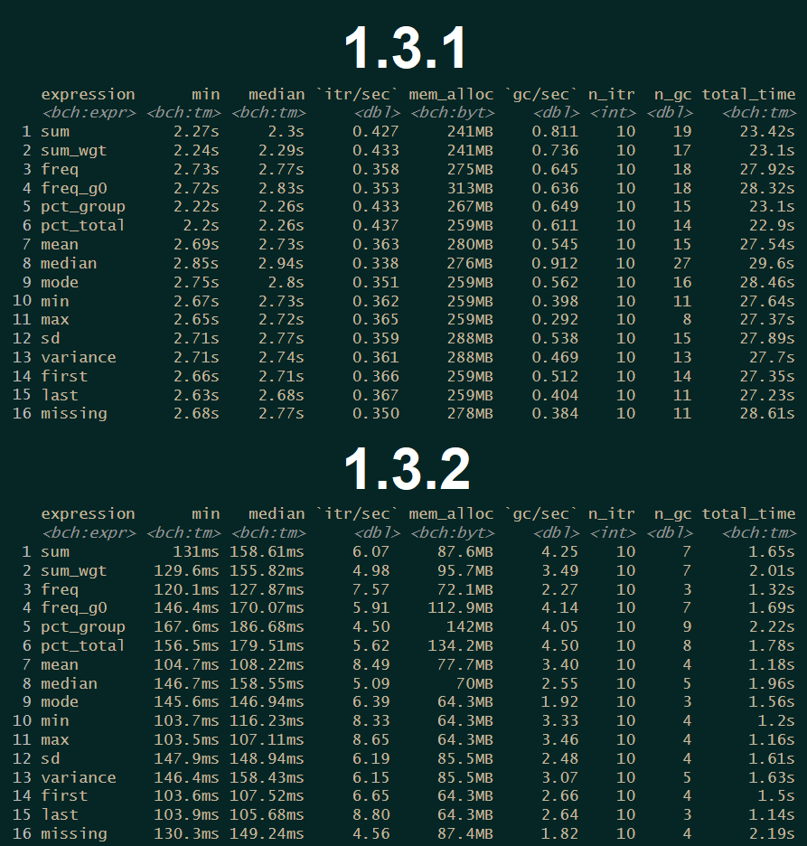
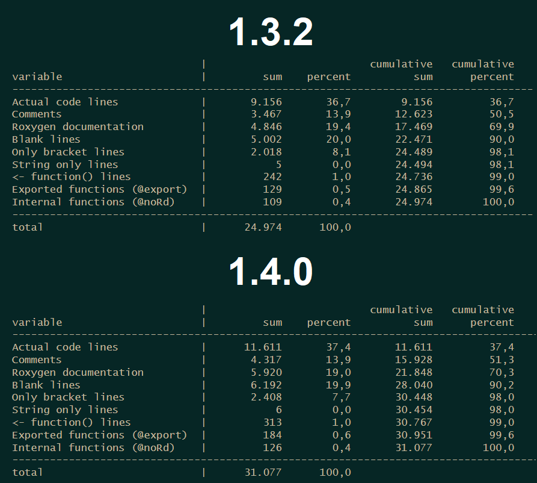

This update brings some long needed optimization, a bunch of bug fixes and some new functionalities. The full release notes can be seen [here](https://github.com/s3rdia/qol/releases/tag/v1.3.2).

### Renamed functions

[retain_sum()](https://s3rdia.github.io/qol/reference/retain.html) has been renamed to [retain_stat()](https://s3rdia.github.io/qol/reference/retain.html) and can now not only retain sums but any statistic available. This means existing code will break if this functions was used.

Additionally the new functions [set_labels()](https://s3rdia.github.io/qol/reference/style_options.html), [get_labels()](https://s3rdia.github.io/qol/reference/style_options.html) replace the functions: [set_variable_labels()](https://s3rdia.github.io/qol/reference/style_options.html), [set_stat_labels()](https://s3rdia.github.io/qol/reference/style_options.html), [get_variable_labels()](https://s3rdia.github.io/qol/reference/style_options.html) and [get_stat_labels()](https://s3rdia.github.io/qol/reference/style_options.html). Again: Existing code will break when these functions where used.

### Optimization

If you turn a blind eye on something for too long, code can get slow. So I optimized some very old part from the code in [summarise_plus()](https://s3rdia.github.io/qol/reference/summarise_plus.html) which makes the function itself and basically every function using this as an engine way faster. But let the numbers speak for themselves (ran on 1 million observations with granular grouping):


Here is the code for the test:

```{R, eval = FALSE}
my_data <- dummy_data(1000000)

bench::mark(
    "sum" = {
        my_data |>
            summarise_plus(class      = c(year, state, household_id),
                           values     = income,
                           statistics = "sum",
                           nesting    = "deepest",
                           merge_back = TRUE)
    },
    "sum_wgt" = {
        my_data |>
            summarise_plus(class      = c(year, state, household_id),
                           values     = income,
                           statistics = "sum_wgt",
                           nesting    = "deepest",
                           merge_back = TRUE)
    },
    "freq" = {
        my_data |>
            summarise_plus(class      = c(year, state, household_id),
                           values     = income,
                           statistics = "freq",
                           nesting    = "deepest",
                           merge_back = TRUE)
    },
    "freq_g0" = {
        my_data |>
            summarise_plus(class      = c(year, state, household_id),
                           values     = income,
                           statistics = "freq_g0",
                           nesting    = "deepest",
                           merge_back = TRUE)
    },
    "pct_group" = {
        my_data |>
            summarise_plus(class      = c(year, state, household_id),
                           values     = income,
                           statistics = "pct_group",
                           nesting    = "deepest",
                           merge_back = TRUE)
    },
    "pct_total" = {
        my_data |>
            summarise_plus(class      = c(year, state, household_id),
                           values     = income,
                           statistics = "pct_total",
                           nesting    = "deepest",
                           merge_back = TRUE)
    },
    "mean" = {
        my_data |>
            summarise_plus(class      = c(year, state, household_id),
                           values     = income,
                           statistics = "mean",
                           nesting    = "deepest",
                           merge_back = TRUE)
    },
    "median" = {
        my_data |>
            summarise_plus(class      = c(year, state, household_id),
                           values     = income,
                           statistics = "median",
                           nesting    = "deepest",
                           merge_back = TRUE)
    },
    "mode" = {
        my_data |>
            summarise_plus(class      = c(year, state, household_id),
                           values     = income,
                           statistics = "mode",
                           nesting    = "deepest",
                           merge_back = TRUE)
    },
    "min" = {
        my_data |>
            summarise_plus(class      = c(year, state, household_id),
                           values     = income,
                           statistics = "min",
                           nesting    = "deepest",
                           merge_back = TRUE)
    },
    "max" = {
        my_data |>
            summarise_plus(class      = c(year, state, household_id),
                           values     = income,
                           statistics = "max",
                           nesting    = "deepest",
                           merge_back = TRUE)
    },
    "sd" = {
        my_data |>
            summarise_plus(class      = c(year, state, household_id),
                           values     = income,
                           statistics = "sd",
                           nesting    = "deepest",
                           merge_back = TRUE)
    },
    "variance" = {
        my_data |>
            summarise_plus(class      = c(year, state, household_id),
                           values     = income,
                           statistics = "variance",
                           nesting    = "deepest",
                           merge_back = TRUE)
    },
    "first" = {
        my_data |>
            summarise_plus(class      = c(year, state, household_id),
                           values     = income,
                           statistics = "first",
                           nesting    = "deepest",
                           merge_back = TRUE)
    },
    "last" = {
        my_data |>
            summarise_plus(class      = c(year, state, household_id),
                           values     = income,
                           statistics = "last",
                           nesting    = "deepest",
                           merge_back = TRUE)
    },
    "missing" = {
        my_data |>
            summarise_plus(class      = c(year, state, household_id),
                           values     = income,
                           statistics = "missing",
                           nesting    = "deepest",
                           merge_back = TRUE)
    },
    iterations = 10,
    check = FALSE
)
```

Be aware: The new percentile behavior is not were it should be as of right now performance wise. It is more like a first iteration, so it will only really work if used with few grouping variables.

Additionally the row and column header merging for the Excel tables has been adjusted, so that all merging operations are now processed in one go instead of per iteration, which cuts down the merging time to almost nothing.

### Code Structure

I was interested to see how much code I brought to paper as of right now, so I implemented a new function [code_statistics](https://s3rdia.github.io/qol/reference/code_statistics.html) which looks through a folder structure in search of R-script files and makes a rough analysis of the code structure. This is what the results looks like:



You also get a data frame which contains the results for each individual file. As you see, the new bigger version 1.4.0 has slightly more code in it, because there are some bigger features in it. But this version still needs some time to get ready for a release.